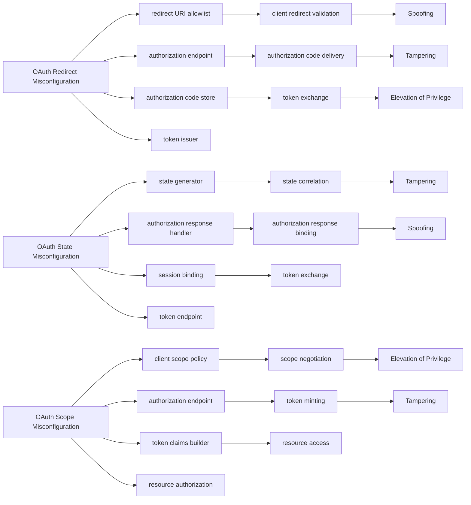
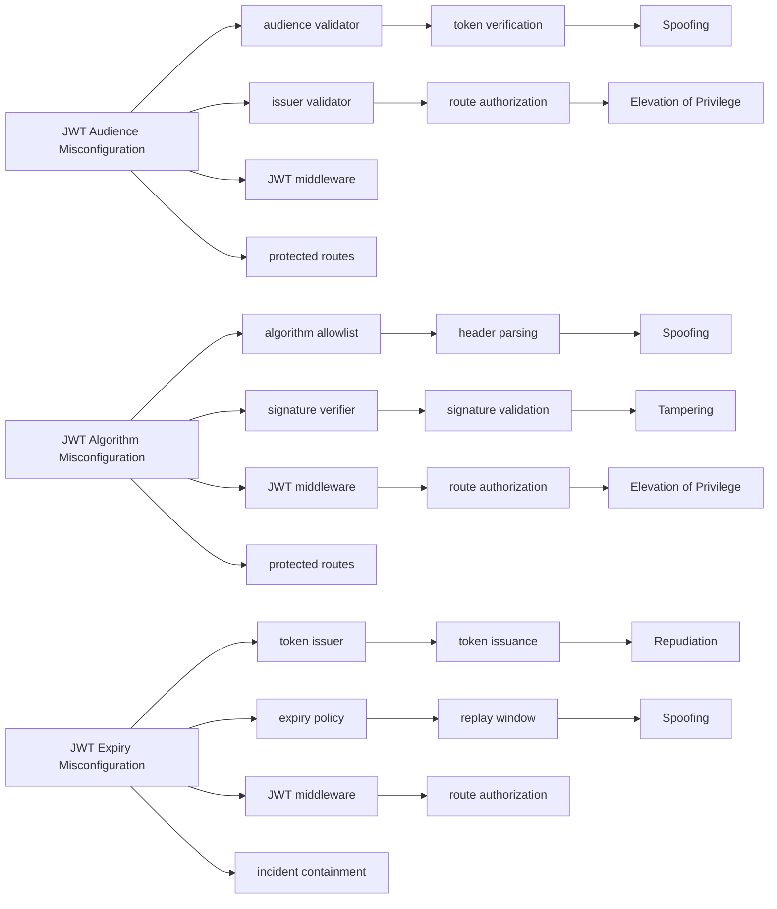
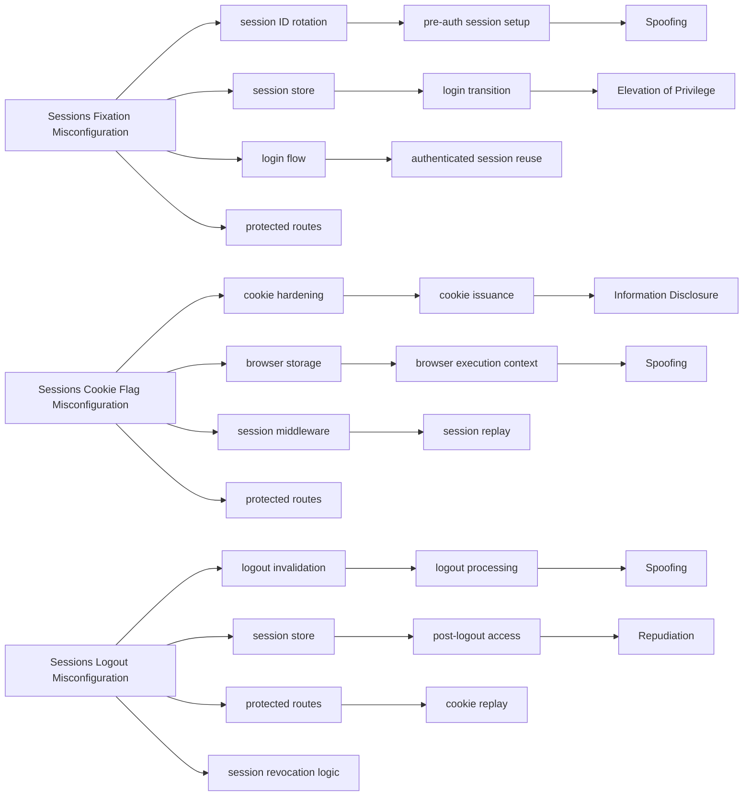

# Failure Propagation Analysis

Generated: 2026-07-23T20:43:34.233Z
Regenerate: npm run analysis:structural

This report models how each controlled authentication misconfiguration propagates beyond its initial defect point into downstream components, flows, and STRIDE consequences.

## Cross-Model Comparison

| Model | Mean Propagation Score (0-10) | Max Variant Score | Avg Components Touched | Avg Flows Touched | Avg STRIDE Breadth | Dominant Pattern |
|---|---:|---:|---:|---:|---:|---|
| OAuth2 | 9.39 | 10.00 | 4.00 | 3.00 | 2.33 | non-linear |
| JWT | 8.57 | 9.63 | 4.00 | 2.67 | 2.33 | linear |
| Session | 8.62 | 8.96 | 4.00 | 3.00 | 2.00 | fan-out |

## Propagation Graphs

### OAuth2

- OAuth2 mistakes propagate non-linearly because redirect, state, code, token, and scope checks compound across multiple trust boundaries.

### JWT

- JWT mistakes tend to propagate linearly through token issuance and validation rules, especially where signature and claim checks are weakened.

### Session

- Session mistakes often amplify quickly because one cookie or invalidation weakness can spill into replay, fixation, and impersonation outcomes.

## Variant Detail

| Variant | Model | Propagation Score | Components | Flows | STRIDE Breadth | Secondary Failures | Narrative |
|---|---|---:|---|---|---|---|---|
| OAuth Redirect Misconfiguration | OAuth2 | 10.00 | redirect URI allowlist authorization endpoint authorization code store token issuer | client redirect validation authorization code delivery token exchange | Spoofing Tampering Elevation of Privilege | authorization code interception token theft unauthorized token issuance | A single redirect allowlist error crosses the browser-client boundary, redirects the code to an attacker endpoint, and then contaminates the token issuance stage. |
| OAuth State Misconfiguration | OAuth2 | 9.33 | state generator authorization response handler session binding token endpoint | state correlation authorization response binding token exchange | Tampering Spoofing | CSRF on auth response wrong-account binding session confusion | State validation failure does not stop at one parameter check; it propagates into the user-session binding decision and can reassign downstream tokens to the wrong principal. |
| OAuth Scope Misconfiguration | OAuth2 | 8.83 | client scope policy authorization endpoint token claims builder resource authorization | scope negotiation token minting resource access | Elevation of Privilege Tampering | over-privileged access token resource overreach | A scope governance error fans out from client registration into token claims and then every protected resource that trusts those claims. |
| JWT Audience Misconfiguration | JWT | 7.63 | audience validator issuer validator JWT middleware protected routes | token verification route authorization | Spoofing Elevation of Privilege | cross-service token reuse unauthorized API access | Weak audience checks propagate almost directly from token verification into route acceptance, so the failure path is short but security-relevant. |
| JWT Algorithm Misconfiguration | JWT | 9.63 | algorithm allowlist signature verifier JWT middleware protected routes | header parsing signature validation route authorization | Spoofing Tampering Elevation of Privilege | token forgery privilege escalation access-control bypass | Algorithm confusion is a classic linear cascade: forged token, accepted signature, trusted route access, then authorization bypass. |
| JWT Expiry Misconfiguration | JWT | 8.46 | token issuer expiry policy JWT middleware incident containment | token issuance replay window route authorization | Repudiation Spoofing | extended replay window delayed revocation effect | Extended token lifetime enlarges the replay window and delays containment, so the propagation is temporal rather than branching. |
| Sessions Fixation Misconfiguration | Session | 8.46 | session ID rotation session store login flow protected routes | pre-auth session setup login transition authenticated session reuse | Spoofing Elevation of Privilege | session hijack authenticated takeover | A fixation bug turns the login transition itself into the propagation point, binding the victim identity to attacker-controlled state. |
| Sessions Cookie Flag Misconfiguration | Session | 8.96 | cookie hardening browser storage session middleware protected routes | cookie issuance browser execution context session replay | Information Disclosure Spoofing | script-readable cookie session theft replay access | Cookie hardening failures propagate outward because once a browser-side boundary is weakened, every subsequent session-bearing request inherits that weakness. |
| Sessions Logout Misconfiguration | Session | 8.46 | logout invalidation session store protected routes session revocation logic | logout processing post-logout access cookie replay | Spoofing Repudiation | stolen cookie replay unauthorized persistence | Failure to invalidate the server-side session after logout turns a single missed revocation event into a continuing authenticated replay path. |

## Interpretation

- Sessions concentrate failure in fewer moving parts, but once cookie or invalidation controls fail, authenticated replay and impersonation can propagate quickly.
- JWT propagation is comparatively linear: one weak validation step tends to map directly to one authorization failure path, which is easier to reason about but still severe.
- OAuth2 exhibits the widest propagation graph because redirect, state, code, token, and scope flows cross more boundaries and therefore branch more aggressively when weakened.
